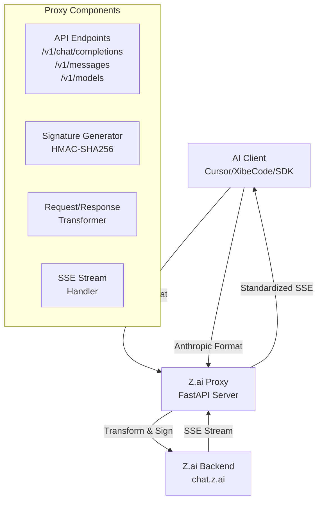
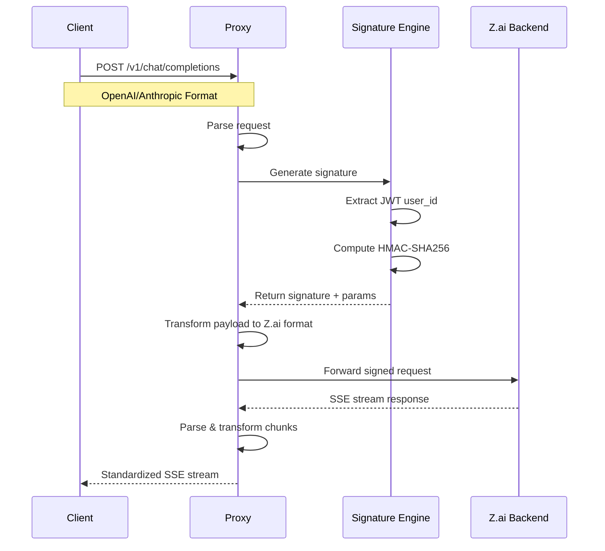
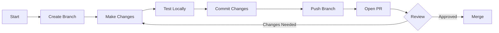

# Contributing to Z.ai API Proxy

Thank you for your interest in contributing to Z.ai API Proxy! This document provides guidelines and instructions for contributing to this project. Please read it carefully before making any changes.

## 📋 Table of Contents

- [Code of Conduct](#code-of-conduct)
- [Getting Started](#getting-started)
- [Development Setup](#development-setup)
- [Project Architecture](#project-architecture)
- [Code Style Guidelines](#code-style-guidelines)
- [Making Changes](#making-changes)
- [Testing](#testing)
- [Pull Request Process](#pull-request-process)
- [Security Considerations](#security-considerations)

---

## Code of Conduct

### Our Pledge

We are committed to providing a welcoming and inspiring community for all. By participating in this project, you agree to:

- Be respectful and inclusive
- Welcome differing viewpoints
- Accept constructive criticism gracefully
- Focus on what's best for the community
- Show empathy towards other community members

### Unacceptable Behavior

Examples of unacceptable behavior include:

- Trolling, derogatory comments, or personal attacks
- Public or private harassment
- Publishing others' private information without permission
- Other conduct which could be considered inappropriate

---

## Getting Started

### Prerequisites

- **Python 3.11+** - The project uses modern Python features
- **Docker** (optional) - For containerized development
- **Git** - For version control
- **A Z.ai account** - Required for testing with real credentials

### Fork and Clone

1. Fork the repository on GitHub
2. Clone your fork locally:

```bash
git clone https://github.com/YOUR_USERNAME/z.ai-proxy.git
cd z.ai-proxy
```

3. Add the upstream repository:

```bash
git remote add upstream https://github.com/ORIGINAL_REPO/z.ai-proxy.git
```

---

## Development Setup

### Option 1: Local Python Environment

```bash
# Create a virtual environment
python -m venv venv

# Activate it
# On Linux/macOS:
source venv/bin/activate
# On Windows:
.\venv\Scripts\activate

# Install dependencies
pip install -r requirements.txt

# Create a .env file with your credentials
cp .env.example .env  # If an example exists, otherwise create manually
```

### Option 2: Docker Development

```bash
# Build the Docker image
docker build -t zai-proxy-dev .

# Run with development settings
docker run -it -p 8000:8000 --env-file .env -v $(pwd):/app zai-proxy-dev
```

### Environment Variables

Create a `.env` file in the root directory with the following required variables:

```env
# Required: Your Z.ai JWT token (from browser DevTools)
JWT_TOKEN="eyJhbGciOi..."

# Required: Your Z.ai browser cookies (from browser DevTools)
COOKIE="__stripe_mid=..."
```

See [README.md](README.md) for detailed instructions on extracting these credentials.

---

## Project Architecture

### Overview



### Request Flow



### File Structure

```
z.ai-proxy/
├── main.py              # Main FastAPI application
│   ├── Configuration    # JWT_TOKEN, COOKIE, UPSTREAM_URL
│   ├── Signature Gen    # generate_zai_request()
│   ├── Endpoints        # /v1/chat/completions, /v1/messages, /v1/models
│   └── Stream Handling  # SSE parsing and transformation
├── requirements.txt     # Python dependencies
├── Dockerfile          # Container build instructions
├── README.md           # Project documentation
├── CONTRIBUTING.md     # This file
└── .env                # Environment variables (not committed)
```

### Core Components

#### 1. Signature Generation (`generate_zai_request`)

This function handles the complex security handshake required by Z.ai:

```python
def generate_zai_request(messages, is_stream, tools, tool_choice):
    # 1. Extract user ID from JWT
    # 2. Generate time-windowed HMAC key
    # 3. Flatten and sort request parameters
    # 4. Compute signature with base64-encoded prompt
    # 5. Build URL params with device fingerprint
    # 6. Return full URL, headers, and payload
```

**Key Points:**
- Uses fixed internal salt: `FIXED_KEY = b"key-@@@@)))()((9))-xxxx&&&%%%%%"`
- Window index: `timestamp // 300000` (5-minute windows)
- Must maintain parameter ordering for signature validity

#### 2. Endpoints

| Endpoint | Method | Purpose | Format |
|----------|--------|---------|--------|
| `/v1/chat/completions` | POST | OpenAI-compatible chat | OpenAI format |
| `/v1/messages` | POST | Anthropic-compatible chat | Anthropic format |
| `/v1/models` | GET | List available models | OpenAI format |
| `/` | GET | Landing page (HTML) | Static HTML |

#### 3. Stream Handling

The proxy uses asynchronous generators for streaming:

```python
async def generate_stream():
    # Open SSL/TLS session with browser impersonation
    # Iterate over SSE chunks
    # Transform Z.ai format -> OpenAI/Anthropic format
    # Yield standardized events
```

---

## Code Style Guidelines

### Python Style

We follow [PEP 8](https://peps.python.org/pep-0008/) with some modifications:

- **Line Length**: 120 characters max
- **Imports**: Group stdlib, third-party, and local imports
- **Naming**: 
  - `snake_case` for functions and variables
  - `UPPER_CASE` for constants
  - `PascalCase` for classes

### Code Organization

```python
# 1. Standard library imports
import os
import time
import uuid

# 2. Third-party imports
from fastapi import FastAPI, Request
from curl_cffi.requests import AsyncSession

# 3. Local imports (if any)
from .utils import helper_function

# 4. Constants (uppercase)
UPSTREAM_URL = "https://chat.z.ai/api/v2/chat/completions"
FIXED_KEY = b"key-..."

# 5. Helper functions
def helper_function():
    ...

# 6. Main application/app
app = FastAPI(title="Z.ai Proxy API")

# 7. Route handlers
@app.post("/v1/chat/completions")
async def handler():
    ...
```

### Documentation

- Use **docstrings** for functions (Google style preferred)
- Add **inline comments** for complex logic
- Update **README.md** for user-facing changes

```python
def get_user_id(jwt_token: str) -> str:
    """
    Extract the user ID from a JWT token's payload.
    
    Args:
        jwt_token: The JWT token string
        
    Returns:
        The user ID string, or empty string on failure
    """
    try:
        payload_b64 = jwt_token.split('.')[1]
        payload_b64 += "=" * ((4 - len(payload_b64) % 4) % 4)
        payload = json.loads(base64.b64decode(payload_b64).decode())
        return payload.get("id")
    except Exception:
        return ""
```

### Async Code

Since this is an async FastAPI application:

- Always use `async def` for route handlers
- Use `AsyncSession` from `curl_cffi` for HTTP calls
- Use `async for` when iterating over async generators
- Always close sessions in `finally` blocks

---

## Making Changes

### Branch Naming

Use descriptive branch names:

- `feature/add-rate-limiting` - New feature
- `fix/signature-expiry` - Bug fix
- `refactor/stream-handler` - Code refactoring
- `docs/update-readme` - Documentation only

### Commit Messages

Follow conventional commits:

```
<type>(<scope>): <description>

[optional body]

[optional footer]
```

**Types:**
- `feat`: New feature
- `fix`: Bug fix
- `refactor`: Code refactoring
- `docs`: Documentation
- `test`: Adding tests
- `chore`: Maintenance tasks

**Examples:**

```
feat(api): add /v1/health endpoint for status checks

fix(signature): handle edge case in timestamp window calculation

docs(readme): clarify cookie extraction steps
```

### Development Workflow



---

## Testing

### Manual Testing

#### Test OpenAI Endpoint

```bash
curl -X POST http://localhost:8000/v1/chat/completions \
  -H "Content-Type: application/json" \
  -H "Authorization: Bearer mock-api-key" \
  -d '{
    "model": "glm-5",
    "stream": true,
    "messages": [
      {"role": "system", "content": "You are a helpful assistant."},
      {"role": "user", "content": "Say hello in 3 languages."}
    ]
  }'
```

#### Test Anthropic Endpoint

```bash
curl -X POST http://localhost:8000/v1/messages \
  -H "Content-Type: application/json" \
  -d '{
    "model": "claude-3-5-sonnet",
    "stream": true,
    "messages": [
      {"role": "user", "content": "Hello!"}
    ]
  }'
```

#### Test Models Endpoint

```bash
curl http://localhost:8000/v1/models
```

### Integration Testing with AI Clients

1. Configure your AI client (Cursor, XibeCode, etc.) to use:
   - **Base URL**: `http://localhost:8000/v1`
   - **API Key**: Any string (it's not validated currently)

2. Test various scenarios:
   - Simple text generation
   - Multi-turn conversations
   - Streaming vs non-streaming
   - Error handling

### Adding Tests

When adding new functionality, consider:

1. **Unit tests** for helper functions
2. **Integration tests** for endpoints
3. **Edge case tests** for error handling

*Note: This project currently does not have an automated test suite. Contributions to add testing infrastructure are welcome!*

---

## Pull Request Process

### Before Submitting

1. **Sync with upstream**:
   ```bash
   git fetch upstream
   git checkout main
   git merge upstream/main
   ```

2. **Rebase your branch** (if needed):
   ```bash
   git checkout your-feature-branch
   git rebase main
   ```

3. **Test your changes locally**:
   ```bash
   # Run the server
   uvicorn main:app --reload
   
   # Test your endpoints
   ```

### Submitting the PR

1. Push your branch:
   ```bash
   git push origin your-feature-branch
   ```

2. Open a Pull Request on GitHub with:
   - Clear title describing the change
   - Description of what was changed and why
   - Any relevant issue numbers (e.g., `Fixes #123`)
   - Screenshots/logs if applicable

3. Wait for review. Address any feedback promptly.

### Review Criteria

PRs are reviewed for:

- ✅ Code quality and style consistency
- ✅ Documentation updates (if needed)
- ✅ No security vulnerabilities
- ✅ Backwards compatibility
- ✅ No breaking changes (or clearly documented)

---

## Security Considerations

### 🔐 Sensitive Data Handling

**CRITICAL:** This project handles sensitive authentication data.

1. **Never commit credentials**:
   - `.env` files are excluded via `.gitignore`
   - Double-check before committing that no tokens/cookies are included

2. **Mask in logs**:
   - When debugging, mask JWT tokens and cookies
   - Never log full credentials

3. **Secrets in code**:
   - Some hardcoded values (like `FIXED_KEY`) are part of Z.ai's public protocol
   - User-specific tokens should always come from environment variables

### 🛡️ Security Best Practices

```python
# ❌ BAD: Hardcoding secrets
JWT_TOKEN = "eyJhbGciOi..."  # Never do this!

# ✅ GOOD: Environment variables
JWT_TOKEN = os.getenv("JWT_TOKEN")
if not JWT_TOKEN:
    raise HTTPException(status_code=500, detail="JWT_TOKEN is missing")
```

### Reporting Security Issues

If you discover a security vulnerability:

1. **DO NOT** open a public issue
2. Email the maintainer directly (if contact info available)
3. Provide details about the vulnerability
4. Allow time for a fix before public disclosure

---

## 📚 Additional Resources

- [FastAPI Documentation](https://fastapi.tiangolo.com/)
- [curl_cffi Documentation](https://github.com/yifeikong/curl_cffi)
- [Server-Sent Events (SSE) Spec](https://developer.mozilla.org/en-US/docs/Web/API/Server-sent_events)
- [HMAC Signature Algorithm](https://en.wikipedia.org/wiki/HMAC)

---

## 🙏 Thank You

Thank you for taking the time to contribute! Every contribution, no matter how small, helps make this project better for everyone.

---

*Last updated: March 2024*