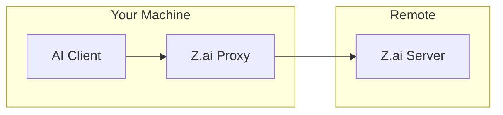
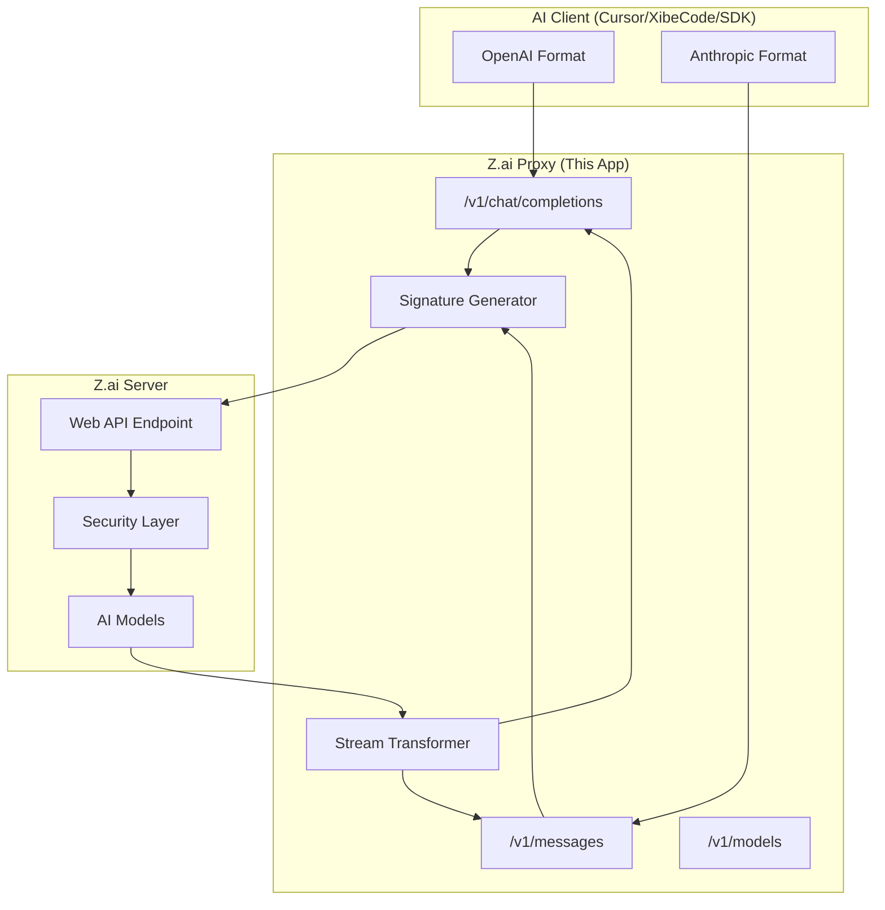
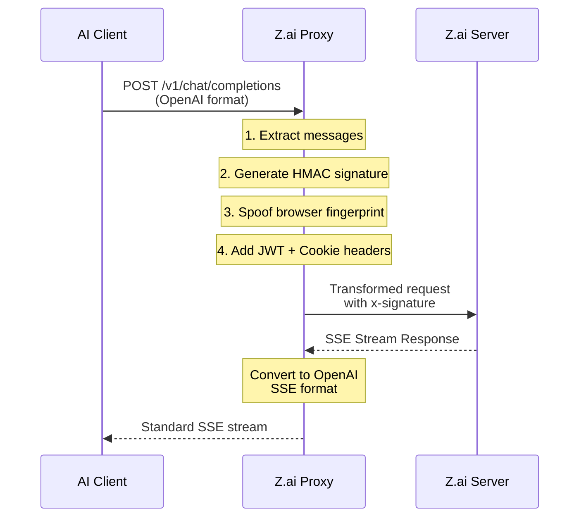
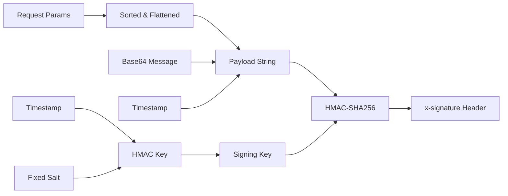
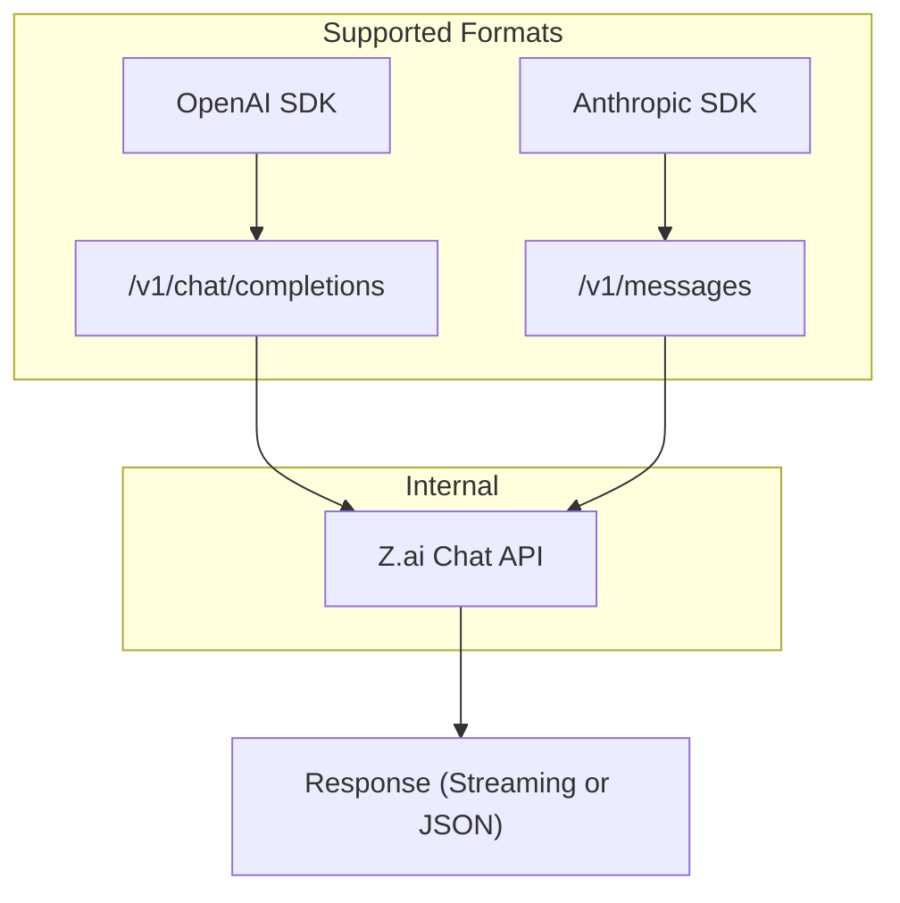
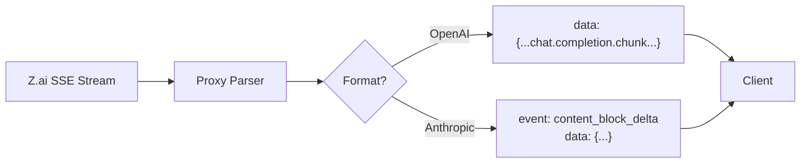
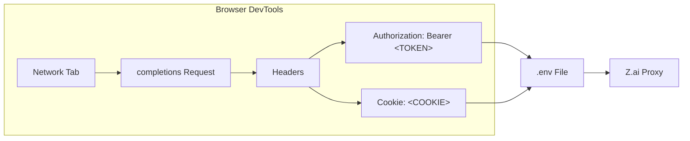
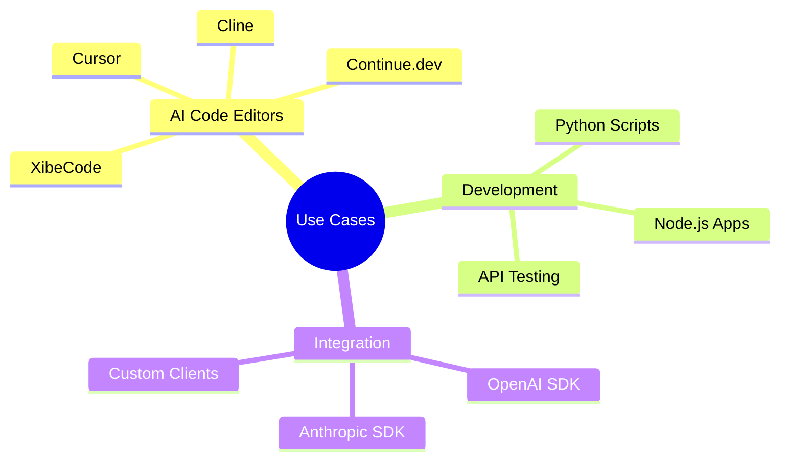
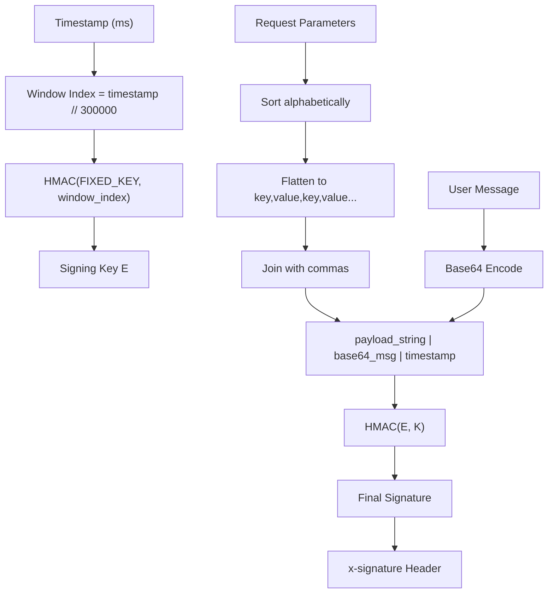

# What is This Project?

## Overview

**Z.ai API Proxy** is a FastAPI-based proxy server that acts as a bridge between standard AI clients and Z.ai's web-based chat API.



## The Problem It Solves

Z.ai provides a powerful AI chat interface through their website (chat.z.ai), but using their API directly from standard AI clients (like Cursor, XibeCode, or SDKs) is blocked by robust security measures:

| Challenge | Description |
|-----------|-------------|
| **426 Upgrade Required** | Server rejects outdated client versions |
| **403 Forbidden** | HMAC-SHA256 signature verification fails for unauthorized clients |
| **Bot Detection** | Cloudflare and TLS fingerprinting block automated requests |

This proxy bypasses these restrictions and provides a clean, standard API interface.

## Architecture



## How It Works

### Request Flow



### Signature Generation Process



## Key Features

### 🔄 Dual API Compatibility



- **OpenAI Format**: `/v1/chat/completions` endpoint
- **Anthropic Format**: `/v1/messages` endpoint
- Use any existing SDK or client that supports OpenAI or Anthropic APIs

### 🔐 Security Bypass Components

| Component | Implementation |
|-----------|----------------|
| **Signature Generation** | Reverse-engineers Z.ai's `x-signature` header using HMAC-SHA256 with a 5-minute windowed key derived from a fixed internal salt |
| **Device Fingerprint** | Spoofs Chrome browser parameters (user agent, viewport, timezone, screen resolution) |
| **TLS Fingerprint** | Uses `curl_cffi` with `chrome124` impersonation to match real browser TLS signatures |
| **Cookie/JWT Passthrough** | Forwards your authenticated session to Z.ai |

### ⚡ Real-Time Streaming



- Full Server-Sent Events (SSE) support
- Token-by-token streaming response
- Reasoning stream extraction for `<details type="reasoning">` thinking blocks
- Works identically to OpenAI/Anthropic streaming APIs

## Project Structure

```mermaid
graph TB
    subgraph Files
        M[main.py] --> F[FastAPI Endpoints]
        F --> OC[/v1/chat/completions]
        F --> AC[/v1/messages]
        F --> ML[/v1/models]
        F --> ROOT[/ - Landing Page]
        
        M --> SG[Signature Logic]
        M --> ST[Stream Transformer]
        
        D[Dockerfile] --> CONTAINER[Container Image]
        R[requirements.txt] --> DEPS[Dependencies]
        E[.env] --> CREDS[Credentials]
    end
```

| File | Purpose |
|------|---------|
| `main.py` | FastAPI application with all endpoints and signature logic |
| `Dockerfile` | Container configuration for easy deployment |
| `requirements.txt` | Python dependencies (FastAPI, curl_cffi, uvicorn, dotenv) |
| `.env` | Your JWT_TOKEN and COOKIE credentials |

## API Endpoints

| Endpoint | Method | Description | Format |
|----------|--------|-------------|--------|
| `/` | GET | Beautiful landing page (HTML) | N/A |
| `/v1/chat/completions` | POST | OpenAI-compatible chat endpoint | OpenAI |
| `/v1/messages` | POST | Anthropic-compatible messages endpoint | Anthropic |
| `/v1/models` | GET | List available models | OpenAI |

## Available Models

| Model ID | Provider | Description |
|----------|----------|-------------|
| `glm-5` | Z.ai | Z.ai's primary language model |
| `claude-3-5-sonnet-20241022` | Anthropic | Claude 3.5 Sonnet via Z.ai |

## Setup Requirements

To use this proxy, you need credentials extracted from your browser:



### Required Credentials

1. **JWT_TOKEN** - Your authentication token from Z.ai website (found in browser DevTools > Network tab > Authorization header)
2. **COOKIE** - Your session cookie from Z.ai website (found in browser DevTools > Network tab > Cookie header)

These are stored in a `.env` file:

```env
JWT_TOKEN="eyJhbGciOi..."
COOKIE="__stripe_mid=..."
```

## Quick Start

```bash
# Install dependencies
pip install -r requirements.txt

# Create .env file with your credentials
echo 'JWT_TOKEN="your-jwt-token-here"' > .env
echo 'COOKIE="your-cookie-string-here"' >> .env

# Run the proxy
uvicorn main:app --host 0.0.0.0 --port 8000
```

Then configure your AI client to use `http://localhost:8000/v1` as the API endpoint.

### Docker Deployment

```bash
# Build image
docker build -t zai-proxy .

# Run container
docker run -d -p 8000:8000 --env-file .env --name zai-proxy zai-proxy
```

## Use Cases



- **AI Code Editors**: Use Z.ai with Cursor, XibeCode, Cline, or any OpenAI-compatible editor
- **Scripting**: Integrate Z.ai into Python/Node/other scripts using standard SDKs
- **Testing**: Test AI functionality without using official API calls
- **Prototyping**: Quick integration without learning new API formats

## Security Note

> ⚠️ **Warning**: This proxy uses YOUR authentication credentials. Keep your `.env` file secure and never share your JWT token or cookies publicly.

## Technical Deep Dive

### Signature Algorithm



The proxy calculates a complex HMAC-SHA256 signature by:

1. Generating a 5-minute windowed HMAC key using a fixed internal salt
2. Sorting and flattening key request parameters (timestamp, request ID, user ID)
3. Hashing the flattened metadata along with the base64-encoded user message

---

*This project is for educational and personal use only. Use at your own risk and respect Z.ai's Terms of Service.*